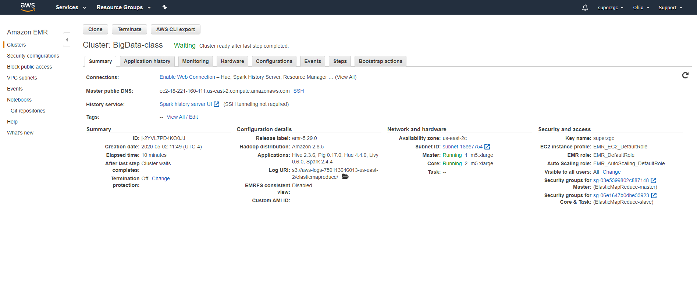
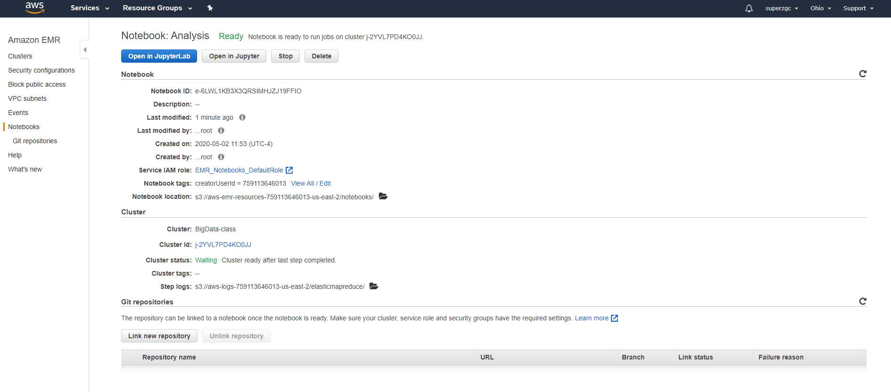
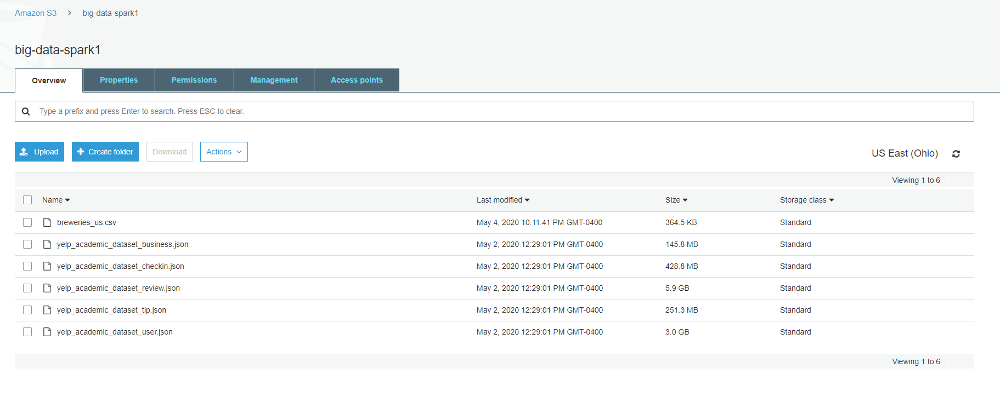

# Project Description

Use AWS EMR and S3 to download large dataset from kaggle, and analyze the data.\
The large dataset is stored in S3. AWS EMR provides cluster and PySpark in Jupyter notebook environment for us to analyze the data in DateForm easily. 

## Configuration of the cluster

## Configuration of the Jupyter notebook

## S3 management page for the yelp files

